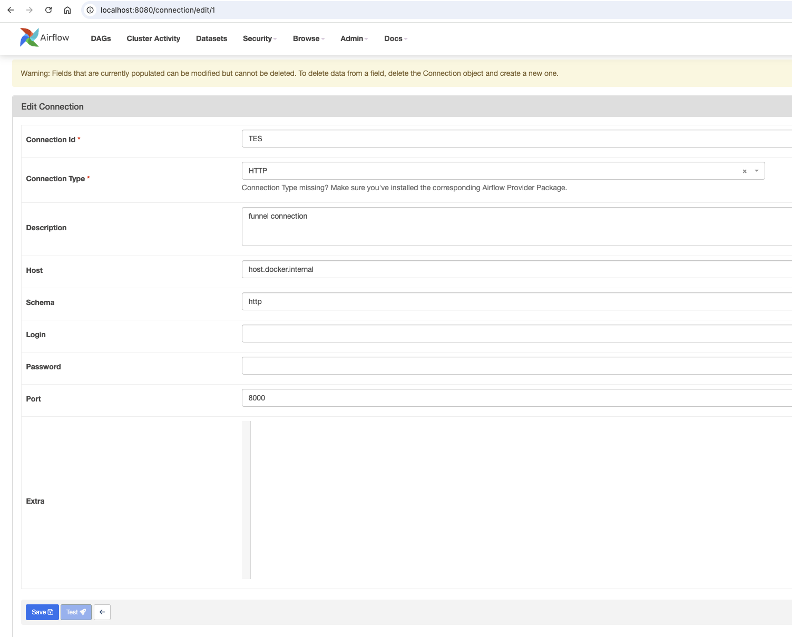

# Funnel


## Overview

* Funnel is a tool for managing and executing data workflows. It provides a simple and efficient way to define, schedule, and monitor data processing tasks. With Funnel, you can easily create complex workflows that involve multiple steps, dependencies, and data transformations.

* Here we install funnel as the `executor` for airflow DAGs.


## Install

See [funnel docs](https://ohsu-comp-bio.github.io/funnel/download/)

* macOS
```bash
brew tap ohsu-comp-bio/formula
brew install funnel
```

## Run

```bash
funnel server run  -c config.yaml  --Logger.Level debug
```

## Configuration

* funnel: see [config.yaml](config.yaml)
* airflow:


## Airflow Usage 
See [create_tes_ping.py](../dags/create_tes_ping.py)